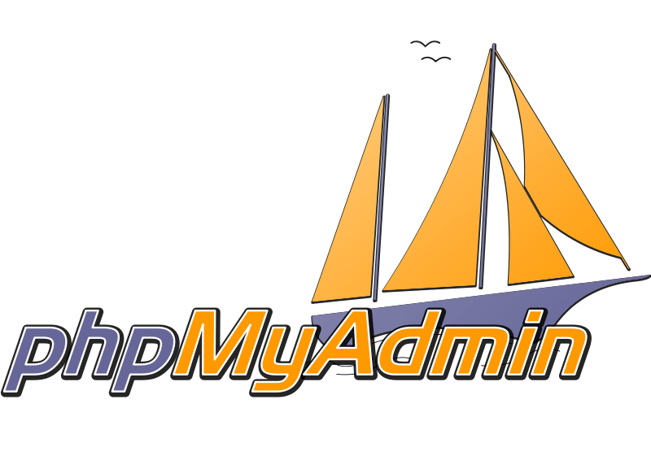
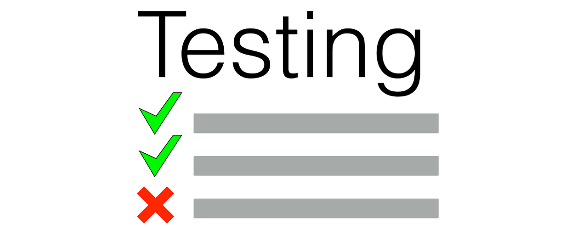

# PHP

[](https://github.com/lumunizf/PHP/blob/master/LICENSE)

[](https://github.com/lumunizf/PHP/issues) 
[](https://img.shields.io/github/issues-closed/lumunizf/PHP)
[](https://github.com/lumunizf/PHP/commits/master)

[](https://twitter.com/lumunizf)
[](https://medium.com/@lumunizf)

<div align="center">
    <a href="https://php.net">
        
    </a>
</div>


-------
<p align="center">
    <a href="#motivação">Motivação</a> &bull;
    <a href="#requisitos">Requisitos</a> &bull;
    <a href="#configuração">Configuração</a> &bull;
    <a href="#testes">Testes</a> &bull;
    <a href="#license">Licença</a>
</p>

-------

## Motivação

:bulb: Este repositório nasceu da necessidade de exercitar o aprendizado na linguagem de programação PHP com o objetivo de atender às demandas de melhoria do projeto [ALZMEF](https://github.com/lumunizf/ALZMEF "Projeto ALZMEF").

<BR/>
Procurei reunir neste espaço os exercícios realizados, iniciando pelo nível básico e passando a níveis mais avançados ao longo da curva de aprendizado.<BR/>

## Requisitos

🛠️ Ferramentas e tecnologias utilizadas nos exercícios.

 * PHP - Release 7.4.2
 * PHPStorm IDE - Release 2019.3.2
 * Laravel - Release XXXX
 * Composer - Release XXXX
 * MySQL - Release XXXX
 * phpMyAdmin - Release XXXX


## Configuração

### 🛠️ 1. Instalação do PHP

<div align="center">
    
</div>

* Acessar o site oficial do [PHP](https://www.php.net/ "PHP").
* Clicar na versão mais atual e na sequência na seção “Windows Downloads”
* Clicar no arquivo .zip
* Após o download, editar as variáveis de ambiente do sistema no painel de controle informando o local de instalação do PHP
* Para validar a instalação e confirmar a versão atual, digitar no terminal:

```php
php -v
```

* Renomear o arquivo "php.ini-development" para "php.ini"
* Executar o seguinte comando no terminal:

```php
php -a
Echo “Olá Mundo!”;
```

<br/>

### 🛠️ 2. Instalação do PHPStorm IDE

<div align="center">
    
</div>

* Acessar o site da [Jet Brains](https://www.jetbrains.com/phpstorm/download/#section=windows "Jet Brains").
* Clicar na aba correspondente ao sistema operacional e em seguida no botão _download_.

<br/>

### 🛠️ 3. Laravel Framework

<div align="center">
    
</div>

* *coming soon*

<br/>

### 🛠️ 4. Instalação do Composer

<div align="center">
    
</div>

* *coming soon*

<br/>

### 🛠️ 5. Banco de dados MySQL

<div align="center">
    
</div>

* O MySQL pode ser baixado [aqui](https://dev.mysql.com/downloads/mysql/).
* Selecione o seu sistema operacional (Windows, Mac, Linux) e baixe o pacote correto.
* Execute e a instalação acontecerá. <**!!!!!!!!!!!!!!!!!!!1 Ainda faltam mais instruções!**>

<br/>

### 6. Instalação do phpMyAdmin

<div align="center">
    
</div>

O phpMyAdmin é uma interface gráfica que ajuda a visualizar e administrar o MySQL.

O download pode ser feito [aqui](https://www.phpmyadmin.net/) e após o término é preciso subir um servidor php em sua pasta. <**!!!!!!!!!!!!!!!!!!!1 Ainda faltam mais instruções!**>

<br/>

## Testes

<div align="center">
    
</div>

:beetle: Você pode executar os testes dos exercícios a qualquer momento. <BR/>
:heavy_check_mark: Tudo o que você precisa fazer é digitar no terminal:

```php
cls
php <<nome-do-programa.php>>
```

<br/>

-------

## License

⚖️ Este projeto está licenciado sob os termos da **MIT License** © [Luciana Muniz Freire](https://br.linkedin.com/in/lumunizf). <BR/>
Para mais informações leia o arquivo de [LICENÇA](https://github.com/lumunizf/Test-automation/blob/master/LICENSE).